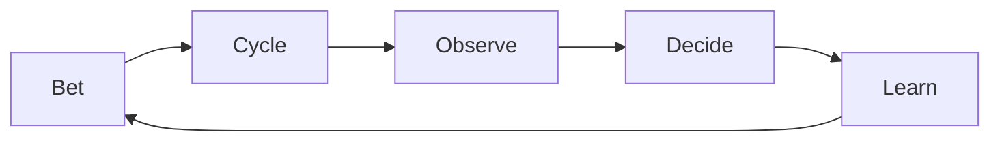

> [Next: The Decision Spine ->](02-spine.md)

# Chapter 1: Why FLOW Exists

> **FLOW: Decide what to bet on. Run small cycles. Kill what's not working. Keep what you learn.**

---

## The Problem

Teams build before they understand what to build. And once they start, they cannot stop.

A stakeholder says "we need a scheduling feature." The team writes tickets, estimates effort, and starts coding. Nobody asks whether users actually need scheduling. Three months later, the feature ships to 3% adoption. The code was clean. The tests passed. The feature was wrong.

Worse: once work starts, it almost never gets killed. A feature that should have died at week two limps along for six months. Nobody has the permission, the process, or the data to stop it. Sunk cost wins. Evidence loses.

These failures are not caused by bad people. They are caused by methodologies that optimize for delivery speed instead of decision quality.

---

## The Thesis

FLOW optimizes for **decisions**, not velocity.

Every concept in FLOW exists to answer one of three questions:

1. **What should we learn?** Before building, what do we need to understand?
2. **What should we build?** Given evidence, what is worth investing in?
3. **What should we stop?** Given the evidence, what is failing and needs to die?

If your methodology does not help you answer all three, you will build the wrong things and be unable to stop.

---

## The FLOW Loop

All of FLOW is this loop, repeated:

**Bet** on something worth testing. Run a **Cycle** to test it. **Observe** what happens. **Decide** to continue, pivot, or kill. Capture the **Learning**. Then bet again — or stop.

The loop runs at whatever speed your context allows. A solo founder with AI agents loops in days. A 40-person bank team loops in weeks. The loop is the same. The clock speed differs.

---

## Four Primitives

FLOW has four building blocks. Everything else is configuration.

| Primitive | What it is |
|-----------|-----------|
| **Cycle** | A bounded unit of work — Discovery (learning) or Outcome (shipping). Has a start, a kill condition, and an end. |
| **Decision** | The output of every cycle. Continue, pivot, kill, or merge. Decisions are traced, recorded, and reviewable. |
| **Learning** | What survives after a cycle ends. Captured in a Learning Entry. Learnings compound across cycles. |
| **Two Modes** | Discovery (primary risk: building the wrong thing) and Outcome (primary risk: failing to ship the right thing). The mode determines the process. |

---

## Three Gates

Every cycle passes through three gates:

| Gate | When | Purpose |
|------|------|---------|
| **G1 Commit** | Before the cycle starts | Blocks entry. Is the bet clear? Is the kill condition set? Is the experiment or scope defined? |
| **G2 Pulse** | Mid-cycle or on-demand | Health check. Is the kill condition approaching? Is evidence accumulating? Should we pivot? |
| **G3 Resolve** | When the cycle ends | Forces a decision. Kill, merge, continue, pivot, or refine. Produces a record. |

Gates are universal. Their checklists are mode-specific.

---

## Three Artifacts

| Artifact | When produced | What it contains |
|----------|--------------|-----------------|
| **Cycle Brief** | At G1, updated throughout | The living document for the cycle: bet, plan, evidence. One per cycle. |
| **Kill/Merge Record** | At G3 | The decision and its reasoning. Why did we kill, merge, or continue? |
| **Learning Entry** | After G3 | What we learned. Survives after the cycle is forgotten. Feeds future bets. |

No other artifacts are required. Teams can add whatever internal documents they want, but FLOW only requires these three.

---

## Three Configuration Dimensions

FLOW adapts to your context through three knobs:

| Dimension | What it controls | Examples |
|-----------|-----------------|----------|
| **Tempo** | How fast you loop (build-observe-decide rhythm) | Days for a solo founder. Weeks for a mid-size team. Months for hardware. |
| **Scale** | How many people, teams, and dependencies | Solo, small team, multi-team, enterprise. Affects coordination overhead. |
| **Rigor** | How formal the artifacts and gates are | Lightweight (a few lines in a doc) to heavyweight (formal review boards). |

You do not pick a profile. You set each dimension to match your reality. A solo founder runs fast tempo, single scale, light rigor. A regulated enterprise runs slow tempo, multi-team scale, heavy rigor. A startup with 8 people is somewhere in between.

---

## Who FLOW Is For

FLOW is for anyone building under uncertainty who needs to decide what to learn, what to build, and what to stop. That includes solo founders, small product teams, agencies juggling multiple clients, enterprise programs, government initiatives, and hardware startups. If you make things and need to decide whether those things are working, FLOW is for you.

---

## Reading Paths

- **New to FLOW?** Read chapters 1 through 8. That covers the full methodology.
- **Going deeper?** See appendices A through F for AI agents, adaptation guides, anti-pattern catalog, templates, glossary, and facilitation.
- **Just need a reference?** Each chapter stands alone. Use the table of contents.

---

> Next: [The Decision Spine ->](02-spine.md)
