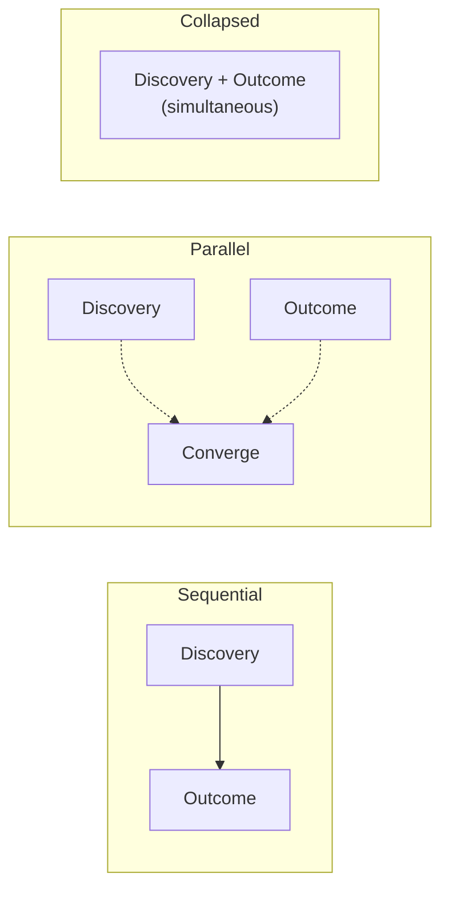

> Part I: Foundation | [← Previous](01-why-flow.md) | [Next →](03-decision-spine.md)

# Chapter 2: The Core Mental Model

> *Panel-reviewed: Meeting #2 (2026-03-19) — 9 agree, 2 modify-accept*
> **Read this**: Everyone. Core concepts for all of FLOW.

---

## Two Modes: Discovery and Outcome

Every piece of product work is in one of two modes:

**Discovery** — the primary risk is building the wrong thing. You don't yet know whether the problem is real, the solution is right, or the approach will work. The goal is **learning**, not shipping. The output is **evidence**, not code.

**Outcome** — the primary risk is failing to ship the right thing. You have evidence that the problem is real and the approach is sound. Now you need to execute. The goal is **shipping**, not learning. The output is **working product**, measured by a target metric.

This is FLOW's foundational insight: **the mode you're in determines the process you follow.** Discovery mode has its own artifacts (Discovery Brief), its own gates (D1-D3), and its own ritual (Discovery Review). Outcome mode has different artifacts (SPEC-Lite, Build Contract), different gates (O1-O5), and different rituals (Outcome Review, Kill/Merge).

Most methodologies don't distinguish modes. Scrum treats a "research spike" and a "build user login" the same way — both are backlog items estimated in story points. Shape Up shapes everything into pitches, whether the team is exploring a new market or building a known feature. SAFe puts both exploratory and delivery work through the same PI Planning ceremony.

FLOW says: **the work tells you which mode to use.** You don't decide your process once and apply it to everything. You read the uncertainty level and select the mode that matches.

---

## The Mode Decision

Ask this question about any piece of work:

> **"Is the primary risk that we build the wrong thing, or that we fail to ship the right thing?"**

If the answer is **"build the wrong thing"** → Discovery mode.
If the answer is **"fail to ship"** → Outcome mode.
If the answer is **"both"** → split the work. Known parts go to Outcome. Unknown parts go to Discovery. They run in parallel.

This question is the entry point to FLOW. Every intake classification, every cycle kickoff, every mode transition starts here.

---

## Mode Relationship Patterns

The relationship between Discovery and Outcome varies by context. FLOW recognizes six patterns:

### 1. Sequential
**Discovery → Outcome.** Learn first, build second. No overlap.

*When*: High cost of building wrong (hardware, regulated products, irreversible decisions). Amara's solar controller: a $5,000 prototype means you discover before you manufacture.

*Cadence*: Discovery cycle completes fully. Gate D3 passes. Outcome cycle begins.

### 2. Parallel
**Discovery on unknowns + Outcome on knowns, simultaneously.**

*When*: Parts of the work are understood, parts aren't. Priya's hospital scheduling module: the data model is known (Outcome), but the nurse UX is uncertain (Discovery). Both run concurrently.

*Cadence*: Two tracks, one initiative. Discovery Brief for the unknowns. SPEC-Lite for the knowns. They converge when Discovery produces evidence.

### 3. Collapsed
**Discovery through building.** The act of shipping IS the experiment.

*When*: Solo founders, tiny teams, consumer products where you can ship to a small audience cheaply. Carlos ships a feature to 50 users on Monday, watches metrics Tuesday, iterates or kills Wednesday. His Discovery and Outcome are the same activity.

*Cadence*: Rapid cycles (days, not weeks). Kill conditions are metric thresholds, not experiment results.

### 4. Oscillating
**Alternating between modes within a cycle.** Build, test, learn, adjust, build more.

*When*: Creative work where the artifact IS the experiment. Dmitri's game studio: build the dodge mechanic, playtest, learn it doesn't feel right, redesign, build again. The cycle oscillates between "is this fun?" (Discovery) and "ship the level" (Outcome).

*Cadence*: Fluid. Mode switches happen daily or even hourly. No formal gate — the team reads the signal and shifts.

### 5. Governance-Gated
**Formal approval required to transition from Discovery to Outcome.**

*When*: Regulated environments, large enterprises, government programs. James's insurance company: a Discovery phase produces a feasibility report. A review board examines the evidence. They formally approve transition to Outcome — or they don't.

*Cadence*: Discovery cycle → Gate review (board/committee) → Outcome cycle. The gate is an organizational event, not just a team decision.

*Who convenes the gate review*: Typically a governance body (project board, change advisory board, or designated decision authority). Evidence required: completed Discovery Brief with experiment results, risk assessment, resource estimate, and compliance impact analysis. The decision must be documented for audit trail.

### 6. Client-Gated
**The client approves the mode transition.**

*When*: Agency and outsourcing work. Rawan's client engagement: the Discovery phase produces findings and recommendations. The client reviews: "Yes, proceed to building" or "No, investigate further" or "Pivot direction."

*Cadence*: Discovery deliverable → Client review → Outcome cycle. The client is the gate. Budget approval often coincides with mode transition.

---

## Mode Selects Process

A common misconception: "FLOW replaces my current process." It doesn't. **Mode selects process.**

If you're in Discovery mode, FLOW provides the Discovery process: Brief → Experiment → Learn → Decide.
If you're in Outcome mode, FLOW provides the Outcome process: SPEC → Contract → Build → Review → Decide.

But within each mode, your team can use whatever execution approach works:
- Kanban boards for task tracking? Fine.
- Daily standups? Fine.
- Pair programming? Fine.
- Shape Up-style appetites within Outcome cycles? Fine.

FLOW operates one level above your daily execution process. It decides WHAT KIND of work you're doing (learning or shipping) and provides the appropriate artifacts and gates. It doesn't dictate HOW you code, HOW you design, or HOW you run your daily work.

This is what makes FLOW adoptable alongside existing methods.

> **Key insight: You don't replace Scrum. You add a layer above it.** "This sprint, are we in Discovery or Outcome mode? Let's use the right artifacts." The same applies to Kanban, Shape Up, SAFe, or any execution framework. FLOW is the decision layer. Your existing tools are the execution layer.

---

## Comparison Matrix

| Concept | Scrum | Shape Up | SAFe | Kanban | Lean Startup | FLOW |
|---------|-------|----------|------|--------|-------------|------|
| **Modes** | None (all work = backlog items) | Shaping vs. Building (structured, senior-only) | Explore vs. Exploit (portfolio level) | None | Build-Measure-Learn (single loop) | Discovery vs. Outcome (explicit, gated) |
| **Cadence** | Fixed sprints (1-4 weeks) | Fixed cycles (6 weeks) + cool-down | PI = 8-12 weeks, sprints within | Continuous | Continuous | Flexible cycles (2-4 weeks typical) |
| **Kill mechanism** | Sprint cancellation (rare, stigmatized) | Appetite runs out (time-based) | WSJF deprioritization | WIP limits (indirect) | Pivot or persevere | Kill conditions (evidence-based, pre-committed) |
| **Traceability** | Product Goal → Sprint Goal | Appetite → Pitch | Strategic Themes → Epics → Features | None formal | Vision → Strategy → Experiments | Vision → Strategy → Bet → Cycle (Decision Spine) |
| **Key artifacts** | Product Backlog, Sprint Backlog | Pitch, Fat Marker Sketch | PI Objectives, Features, Enablers | Cards on board | Lean Canvas, Experiment Cards | Discovery Brief, SPEC-Lite, Build Contract |
| **Roles** | PO, SM, Developers | Shapers, Builders | RTE, PO, System Architect, many | Team (minimal roles) | CEO, CTO (small teams) | PM, Engineer, Designer, Flow Coach |
| **Team topology** | One cross-functional team | Small teams (2-3 + shaper) | ARTs, trains, squads | Flexible | Small team | Stream-aligned, Platform, Enabling, Complicated-subsystem |
| **Governance** | Sprint Review (team level) | Betting Table (leadership) | PI Planning, I&A, System Demo | Visual board | Pivot meetings | Gates (D1-D3, O1-O5), Kill/Merge ritual |

### If You're Coming From...

**Scrum**: The biggest change is classifying work by mode. Not everything is a "user story." Discovery work gets a Discovery Brief, not a story. Outcome work gets a SPEC-Lite, not a PBI. Your sprint cadence can stay — but sprint goals now include kill conditions. Detailed migration in [Chapter 17](18-migration.md).

**Shape Up**: You're already close. Your "shaping" maps to FLOW's intake + shaping. Your "betting table" maps to spine check + admission control. The additions: Discovery mode makes shaping a full team activity (not only seniors), and kill conditions ADD an evidence-based stopping mechanism alongside appetite. A team can keep appetite (time limit) AND use kill conditions (evidence limit) — whichever triggers first stops the work. This is an evolution, not a replacement. Detailed migration in [Chapter 17](18-migration.md).

**SAFe**: SAFe provides portfolio-level governance that many enterprises need. FLOW adds team-level decision clarity within that governance. Your PI Planning maps to spine alignment. Your WSJF maps to intake classification. The additions: explicit Discovery mode for uncertain work (SAFe's "Explore" portfolio state brought down to team level), and pre-committed kill conditions that stop work based on evidence (not just WSJF reprioritization). You can run FLOW's mode classification and kill conditions within SAFe's existing ceremony — adding decision quality without disrupting your governance structure. Detailed migration in [Chapter 17](18-migration.md).

**Kanban**: FLOW adds structure that Kanban intentionally avoids. Your flow-based execution stays — FLOW doesn't require sprints. The addition: mode classification (are you learning or shipping?), kill conditions (when does this card get pulled from the board permanently?), and the Decision Spine (why is this card on the board at all?). Detailed migration in [Chapter 17](18-migration.md).

**Lean Startup**: You share DNA. Build-Measure-Learn IS Discovery mode. FLOW formalizes it with artifacts (Discovery Brief), gates (D1-D3), and explicit transition to Outcome mode. The upgrade: Lean Startup doesn't have a structured building phase — once you "learn," you just... keep iterating. FLOW says: once evidence is sufficient, switch to Outcome mode with a SPEC, Contract, and kill conditions. Detailed migration in [Chapter 17](18-migration.md).

**Waterfall / PRINCE2**: FLOW adds structured learning to your delivery process. Your stage gates map to FLOW gates. Your feasibility studies map to Discovery mode. The upgrade: instead of a single long feasibility → build → test → deploy sequence, FLOW introduces shorter cycles with evidence checkpoints. You can run FLOW cycles within your existing PRINCE2 stages — adding agility without abandoning governance. Detailed migration in [Chapter 17](18-migration.md).

---

*Next: [Chapter 3 — The Decision Spine →](03-decision-spine.md)*
