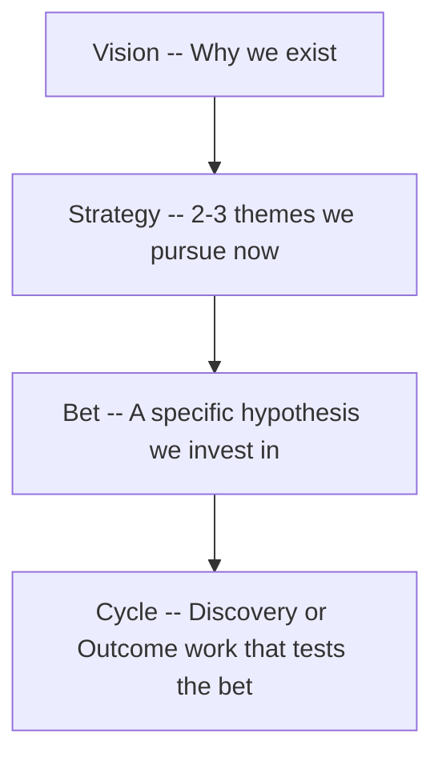

> [Prev: Why FLOW Exists](01-why-flow.md) | [Next: Discovery Mode ->](03-discovery.md)

# Chapter 2: The Decision Spine

Every cycle in FLOW traces upward through four levels. This trace is called the **Decision Spine**.

---

## The Four Levels

**Vision**: The future you are creating. Stable. Changes rarely.
**Strategy**: The 2-3 themes you are pursuing right now. Changes quarterly or when the market shifts.
**Bet**: A specific, falsifiable hypothesis within a strategy. "We believe X will happen if we do Y." Changes when evidence says it should.
**Cycle**: The concrete work — a Discovery cycle (learning) or Outcome cycle (shipping) — that executes on a bet.

---

## Why "Bet"

The word is intentional. A bet is not a promise. It is not a commitment. It is a statement of belief: "We think this will work, and here is why." The language reminds everyone — including leadership — that **we might be wrong**.

This honesty is what makes kill conditions possible. If you call it a "commitment," stopping feels like failure. If you call it a "bet," stopping feels like evidence-based decision-making.

> **For formal contexts**: Government or enterprise teams may prefer "Investment Hypothesis" or "Strategic Initiative." Use whatever language your organization will adopt. What matters is that the concept stays **killable**. If changing the word makes it unkillable, keep "Bet."

---

## The Spine as a Trace

The spine is a pattern, not a document format. Before any cycle starts (at G1 Commit), the team answers:

> "Can you trace this cycle to a bet, that bet to a strategy, and that strategy to the vision?"

If yes, the cycle enters. If no, it goes back to intake or gets rejected.

This is **admission control**. It gives teams a legitimate way to say no: "This does not trace to any active bet. Which strategy does it support?"

---

## The Operational Exception

Not all work traces to a bet. Production incidents, critical bugs, infrastructure fires — these are operational work. They bypass the spine.

But operational work should be tracked separately. If it consistently consumes more than 20% of capacity, that is a signal: either the system has quality problems (which is itself a bet worth pursuing) or the team is using "operational" as a label to bypass the spine.

---

## Mapping Your Organization

Most organizations have more or fewer than four levels. Map them to the spine:

### Enterprise (many levels)

| Your hierarchy | FLOW Spine |
|---------------|------------|
| Enterprise Vision | **Vision** |
| Business Unit Strategy | **Strategy** |
| Program / Initiative | **Bet** |
| Project / Work Package | **Cycle** |

### Solo founder (few levels)

| Your reality | FLOW Spine |
|-------------|------------|
| "I want to make a living from software" | **Vision** |
| "Code review tools are underserved" | **Strategy** |
| "Developers will pay for AI reviews if accuracy > 80%" | **Bet** |
| "Ship the accuracy benchmark this week" | **Cycle** |

Solo founders often skip the Bet level — they just build. Making the bet explicit forces the question: "Why this feature and not the ten others on my list?"

### Agency (split spine)

| Boundary | Level | Owner |
|----------|-------|-------|
| Client-owned | Vision, Strategy | Client leadership |
| Shared | Bet | Negotiated between client and agency |
| Agency-owned | Cycle | Agency delivery team |

### Government

| Level | Maps to |
|-------|---------|
| National Vision (e.g., Vision 2030) | **Vision** |
| Sector Strategy | **Strategy** |
| Program Investment | **Bet** |
| Project Deliverable | **Cycle** |

---

## Maintaining the Spine

Strategy changes. Bets fail. Visions evolve.

**When strategy shifts**: Review all active bets. Do they still trace? Kill the ones that do not.
**When a bet fails**: Kill its cycles. Archive the learnings. Free capacity.
**When vision evolves**: Review the entire spine top to bottom. This is a significant event, not a Tuesday decision.

A healthy spine has 2-4 active strategies with 3-8 active bets total. More than that signals a WIP problem.

---

> Next: [Discovery Mode ->](03-discovery.md)
